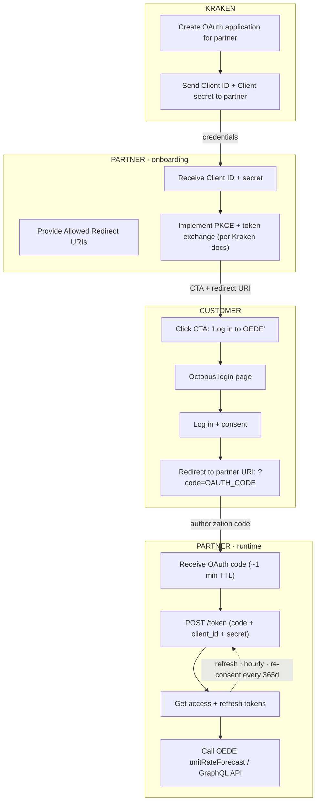

# Octopus Energy (Kraken / OEDE) — Partner OAuth 2.0 Integration Flow

> Transcription of the high-resolution flow diagram (`pngout.png`, 29268 × 12011 px).
> It documents how a **Partner** application obtains a **Customer's** OAuth access token
> from Octopus Energy Germany (**OEDE**, platform = **Kraken**) using the
> **Authorization Code grant (+ PKCE)**, and then calls the OEDE API.

The diagram is a **swimlane** diagram with three horizontal lanes:

| Lane | Who | Role in the flow |
|------|-----|------------------|
| **Kraken** | Octopus / Kraken OAuth platform | Registers the partner's OAuth application, issues credentials, mints tokens |
| **Partner** | The integrating app (e.g. this Homey app) | Holds client credentials, runs the OAuth exchange, calls the OEDE API |
| **Customer** | The end user | Logs in to Octopus and consents to the partner accessing their account |

> 🟨 **Global note (top of diagram):** *"environment (not production)"* — the entire
> setup half is performed in the **test system**.

---

## Phase 0 — Application setup *(Kraken lane — one-time, done by Kraken for the partner)*

1. **Kraken creates an OAuth application in Kraken for the partner.**
2. **Kraken forwards `Client secret` + `client ID` to the partner.**
   - 💬 *"This authenticates the partner app to us — kind of a 'Kraken password' for the partner."*

**Embedded screenshot — Kraken "Create Application" form (German UI):**
- `Anwendungsname *` — application name
- `type *` → **Confidential client** *(public/browser apps → "Public Client"; apps that talk to a backend → "Confidential client")*
- `Client secret *` *(the value cannot be shown again — store it securely)*
- `Authorization grant type *` → **Authorization code grant** *("Entspricht dem OpenID-Connect-Flow…")*
- `Liste der zulässigen URIs` — allowed redirect URIs, space-separated
- `Permissions` (Berechtigungen)
- Refresh-token option ("Auffrischungstoken erhalten") + **"Custom refresh token lifetime"**
- Buttons: `Abbrechen` · **`Create application`**

> 💬 *"application already created in the test system, including client type, permissions etc.
> 'Custom refresh token lifetime' set to **365d**."*

```
[Kraken creates OAuth-Application for partner]  ──▶  [Kraken forwards "Client secret" + "client ID" to partner]
```

---

## Phase 1 — Partner onboarding *(Kraken ▸ Partner lane)*

3. **Partner forwards the `Allowed URIs list`** (the redirect URIs registered above).
4. **Partner receives `Client secret` + `client ID`** (handed down from the Kraken lane).
5. **Partner follows the Kraken docs to switch the `Client secret` for an Access + Refresh Token.**
   - 💬 *"determines: where does the partner want to authenticate with Kraken … Plus: Kraken can
     verify who the request comes from — and redirect to the partner page at the end."*

**Embedded screenshot — Kraken OAuth server landing:** *"Willkommen auf dem OAuth-Server. Dieser Server implementiert OAuth 2.0:"*
- • **Authorization with PKCE** (Proof Key for Code Exchange)
- • Client credentials
- *Erste Schritte:* "Um den OAuth-Server zu nutzen, kontaktiere uns bitte, um einen OAuth-Antrag [zu stellen] … Bitte gib eine kurze Beschreibung der Anwendung…"

**Embedded code example — *"Beispiel (Berechtigung)"*** *(annotated: "1.–4. determined by Kraken; relevant for partner from the 'example'")*:

```js
// 1. PKCE Code Verifier und Challenge generieren
const codeVerifier = crypto.randomUUID().replace(/-/g, …);
const encoder = new TextEncoder();
const data = encoder.encode(codeVerifier);
const digest = await crypto.subtle.digest('SHA-256', data);
const codeChallenge = btoa(String.fromCharCode(...new Uint8Array(digest)));
```
```http
# 2. Genehmigung beantragen
GET /authorize?response_type=code&client_id=YOUR_CLIENT_ID&redirect_uri=…

# 3. Autorisierungscode für Zugangstoken austauschen
POST /token
Content-Type: application/x-www-form-urlencoded

grant_type=authorization_code&code=AUTH_CODE&redirect_uri=YOUR_REDIRECT…

# 4. Zugang zur geschützten Ressource
GET /resource
Authorization: YOUR_ACCESS_TOKEN
```

> 💬 *"necessary so that the partner can call up the OEDE login form / implement the code in the app
> → i.e. with this step OEDE has made the preparations so the customer can log in via the partner."*

```
[partner forwards "Allowed URIs list"]      [partner receives "Client secret" + "client ID"]  ──▶  [partner follows Kraken Docu: switch "Client secret" for Access + Refresh Token]
            ▲                                                  ▲
            └─ allowed redirect URIs                           └─ from Kraken lane (Phase 0)
```

---

## Phase 2 — Customer login & consent *(Customer lane)*

6. **Customer clicks the CTA for OE login in the partner app.**
   - 💬 *CTA e.g. **"Log in to OEDE now and enable smart control."** The partner URI from the
     "Allowed URIs list" is **passed as a parameter** when forwarding the customer to the login.*
7. **Customer is forwarded to the Login.**
   - 🖼️ *Octopus Energy login page* (octopus energy logo, e-mail/password, 1Password autofill,
     *"ich habe mein Passwort vergessen"*, *"…Registriere dich hier!"*).
8. **Customer logs in and decides whether to give the partner application access to their account.**
   - 🖼️ *Consent dialog:* **"Allow `Test: Constis Waschmaschine` to access your account?"**
     with **Cancel** / **Log out** (purple buttons). *(The test partner app is literally named
     "Waschmaschine" / washing machine — a smart-appliance integration.)*
9. **If the customer allows access, they are redirected to partner content** (link = the URI
   originally provided by the partner):

   ```
   <REDIRECT_URI>?code=<OAUTH_CODE>
   ```
   - The displayed content is **determined by the partner**.

```
[Customer clicks CTA for OE login]  ─▶  [customer forwarded to Login]  ─▶  [customer logs in + consents]  ──▶  [allowed → redirect to partner: <REDIRECT_URI>?code=<OAUTH_CODE>]
```

---

## Phase 3 — Token exchange & API use *(Customer ▸ Partner lane)*

10. **Partner receives the OAuth code** (the "text module" generated by Kraken through the customer's
    click). ⏱️ *The code has **≈ 1 min validity**.*
    - 💬 *"Link = an endpoint that already exists and must be implemented by the partner (see docs).
      As soon as the customer (KD) has logged in via the partner, the partner must insert the OAuth
      code + the above data received from Kraken."*
11. **Partner calls `https://auth.oeg-kraken.energy/token/`** with the `OAUTH_CODE`, `CLIENT_ID`
    and `CLIENT_SECRET`.
12. **Input at the endpoint generates the access + refresh tokens.**
    - 💬 *"Token is generated once or several times per customer by Kraken — it is the 'Key' to
      query the OEDE API — = step 3 in the docu."*
13. **With the Access Token for the customer, the partner can query the OEDE `unitRateForecast`
    API (Test, Prod) and implement it per its own logic.**
    - 💬 *"Access token must be renewed with the refresh token ~**1× per hour**. The refresh token
      expires every **365 days** and the customer must grant access again in the app. The partner
      receives prices similar to the GraphQL Explorer / customer view. Process (potentially): the
      app is linked to appliances; the token from Kraken is linked to appliances; customers who
      accept benefit from control."*

```
[partner receives OAuth code]  ─▶  [partner calls /token with OAUTH_CODE, CLIENT_ID, CLIENT_SECRET]  ──▶  [endpoint generates access + refresh tokens]  ─▶  [use Access Token → OEDE unitRateForecast API]
        ▲
        └─ from Customer lane (Phase 2, step 9 — the redirect carrying ?code=…)
```

---

## End-to-end happy path



---

## Endpoints & parameters referenced in the diagram

| Item | Value |
|------|-------|
| Token endpoint | `POST https://auth.oeg-kraken.energy/token/` |
| Authorize | `GET /authorize?response_type=code&client_id=…&redirect_uri=…` |
| Token exchange body | `grant_type=authorization_code&code=AUTH_CODE&redirect_uri=…` |
| Protected resource | `GET /resource` · header `Authorization: <access_token>` |
| Redirect back to partner | `<REDIRECT_URI>?code=<OAUTH_CODE>` |
| Grant type | Authorization code grant (+ **PKCE**) |
| Client type | Confidential client |
| Authorization code TTL | ~1 minute |
| Access token | renew ~hourly via refresh token |
| Refresh token | expires every 365 days → customer must re-consent |
| Target API | OEDE `unitRateForecast` (Test + Prod) |

---

## How this was transcribed (method & confidence)

The image viewer was unavailable in the session that produced this file, so the diagram was
reconstructed **directly from the pixels** with Python (OpenCV + tesseract + scikit-image):

- **Text (high confidence):** every label was OCR'd per-region at 2× and positioned by bounding box.
- **Lanes (high confidence):** from the large left-margin labels *Kraken / Partner / Customer*.
- **Connectors (measured):** the flow arrows are **black** (`≈ #000030`). Edges were confirmed by
  detecting thin black bands crossing the corridors between boxes, and by skeleton-tracing
  individual arrows. Directly measured edges include `K1→K2`, `P2→P3`, `P5→P6`, `C3→C4`
  (within-lane), and the cross-lane links `Kraken→Partner` (credentials) and
  `Customer→Partner` (authorization code). The cyan rectangles are box borders; purple fills are
  UI buttons inside the embedded screenshots.
- **Ordering of the remaining sequential steps** follows the lane layout (left→right, top→bottom)
  and the unambiguous OAuth-code semantics of the box text.
- A few embedded-screenshot strings are German UI text with minor OCR noise; obvious cases were
  normalized.
